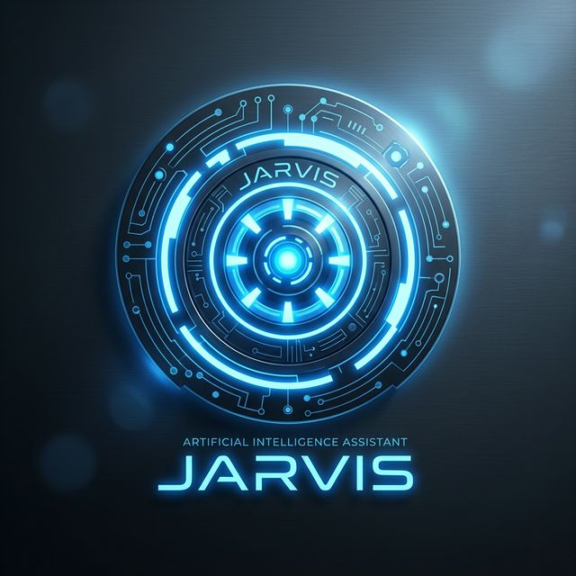

<div align="center">
  
  <h1>JARVIS - AI Work Assistant</h1>
  <p><i>"The future of work, automated."</i></p>

  <p>
    
    
    
    
  </p>
</div>

---

## 🚀 Why JARVIS?

As a Software Engineer, I found myself overwhelmed by back-to-back meetings, fragmented communications across Slack and WhatsApp, and a never-ending stream of tasks. I needed a tool for myself—a true second brain that didn't just record, but understood my workflow. 

**JARVIS** was built to solve this. From real-time meeting assistance to cross-platform message summarization, JARVIS ensures you stay in the flow, focus on coding, and never miss a critical detail again.

### ✨ Key Features

- 🎤 **Meeting Agent**: Joins Google Meet/Zoom, provides real-time transcription, and generates actionable meeting notes.
- 💬 **Message Agent (Beta)**: Intelligent monitoring of Slack, WhatsApp, and Email with automated summarization.
- ✅ **Task Agent (Working)**: Automated GitHub PR reviews, dependency management, and file organization.
- 🌍 **Multilingual Support**: Fluent in English, French, and Tunisian Arabic.
- 🛡️ **Stealth Mode**: Localized browser processing for privacy during sensitive meetings.

---

## 🚀 Quick Start

### 🐳 Method 1: Docker (Recommended)
Launch the entire stack (Backend + DB + Redis) with one command:
```bash
docker-compose up -d
```

### 🐍 Method 2: Local Development
```bash
# Setup Backend
cd backend
python -m venv .venv
source .venv/bin/activate  # or .venv\Scripts\activate on Windows
pip install -r requirements.txt

# Run Dev Server
uvicorn app.main:app --reload --port 8000
```

---

## 🧩 Chrome Extension Setup

To use the **Meeting Agent**, you must install the JARVIS browser companion:

1. Open Chrome and go to `chrome://extensions/`.
2. Enable **Developer Mode** (top right).
3. Click **Load Unpacked**.
4. Select the `chrome-extension/` folder from this repository.
5. Open any Google Meet link and click **ACTIVATE JARVIS**.

---

## 📂 Project Structure

```text
jarvis/
├── backend/            # Python FastAPI backend core
│   ├── app/
│   │   ├── agents/     # Agent logic (Meeting, Message, Task)
│   │   ├── ai/         # LLM & Whisper client integrations
│   │   └── api/        # REST API endpoints
├── chrome-extension/   # Browser companion for Google Meet
├── telegram-bot/       # Control interface (Development)
├── frontend/           # Angular monitoring dashboard (Planned)
└── docker-compose.yml  # Infrastructure orchestration
```

---

## 🗺️ Roadmap

- [x] Real-time Google Meet transcription.
- [x] Claude 3.5 Sonnet Integration.
- [/] **Message Agent**: Basic Slack integration.
- [ ] **Task Agent**: Automated GitHub PR review flow.
- [ ] **Frontend**: Web Dashboard for meeting history.
- [ ] **Voice**: Voice-command control for agents.

---

## 📄 License
Distributed under the MIT License. See `LICENSE` for more information.
